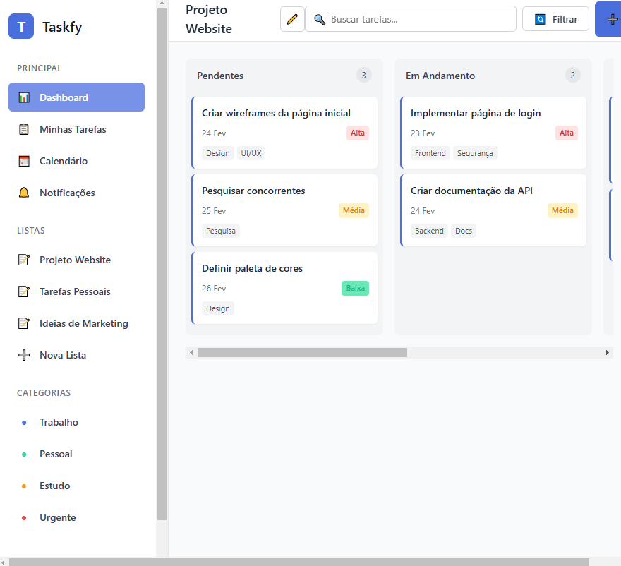
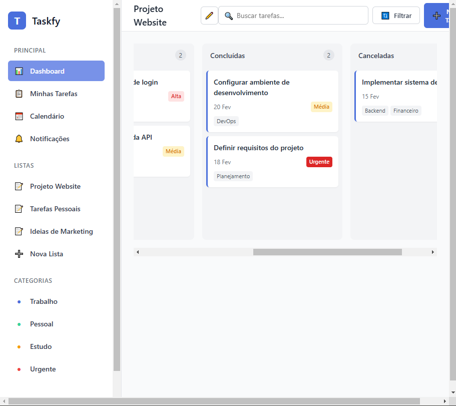
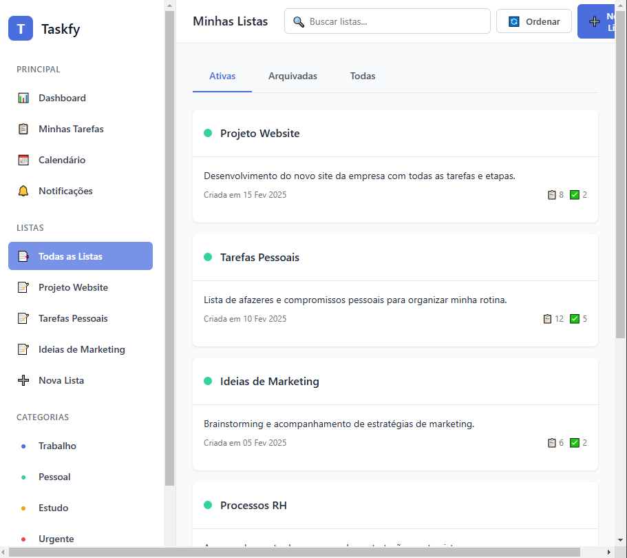
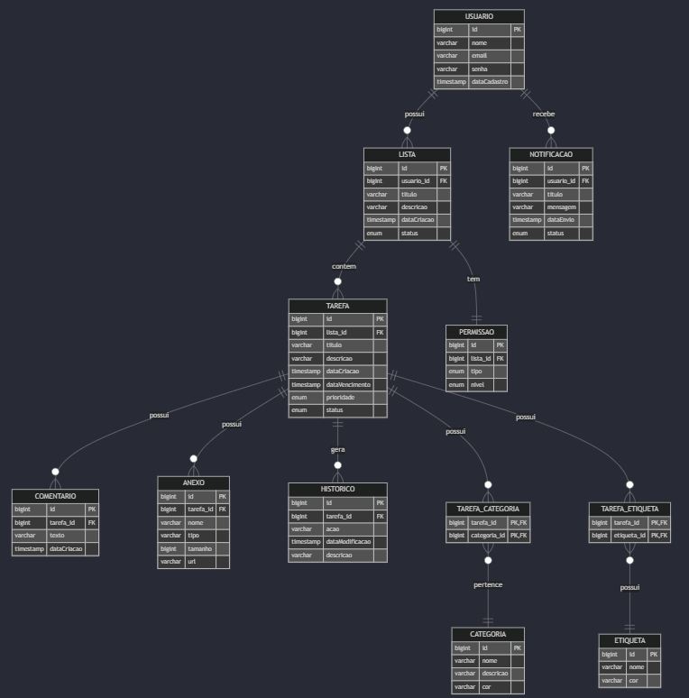

 
<br>
<br>

# Taskify
[](https://github.com/SEU_USUARIO/taskify/blob/main/LICENSE)

# Sobre o projeto

O Taskify é um sistema completo de gerenciamento de tarefas, projetado para otimizar a produtividade e organizar as atividades diárias. Com uma interface intuitiva e recursos poderosos, ele permite que você crie, edite e acompanhe tarefas facilmente. Ideal para equipes e indivíduos que buscam um jeito eficiente de gerenciar suas listas de afazeres.

## Layout web



## Modelo conceitual

### Diagrama de DER


# Tecnologias utilizadas
## Back end
- API RESTful com arquitetura em camadas
- Java 21 (Linguagem)
- Spring Boot (Framework)
- Spring Data JPA
- Spring Security (OAuth2, JWT, Basic Auth, Form Login, OAuth2 com Google)
- Spring HATEOAS 
- MySQL (banco de dados)
- Flyway (Controle de versão do banco de dados)
- Redis (Cache)
- Maven (Gerenciador de dependências)
- Bean Validation (Validação)
- Lombok 
- JUnit, Mockito (Testes)
- Spring Actuator (Monitoramento: Grafana, Prometheus).
- Swagger (Documentação)
## Front end
- Angular
## Implantação em produção
- Back end: AWS EC2
- Front end web: AWS S3
- Banco de dados: PostgreSQL
- Infraestrutura: Docker Compose, CI/CD (GitHub Actions)

# Como executar o projeto

## Back end
Pré-requisitos: Java 21, Maven, MySQL, Redis, Docker

```bash
# clonar repositório
git clone https://github.com/SEU_USUARIO/taskify.git

# entrar na pasta do projeto back end
cd taskify/backend

# configurar variáveis de ambiente (exemplo: application.properties ou .env)
# ex.: DATABASE_URL, REDIS_HOST, etc.

# executar o projeto
mvn spring-boot:run
```
## Front end web
Pré-requisitos: Node.js, Angular CLI
```bash
# clonar repositório
git clone https://github.com/SEU_USUARIO/taskify.git

# entrar na pasta do projeto front end web
cd taskify/frontend

# instalar dependências
npm install

# executar o projeto
ng serve
```
## Autor
 Gabriel lucas rodrigues souza
 <br>
LinkedIn: https://www.linkedin.com/in/gabriellglrs/
 <br>
 <br>
<div align="center">
  
</div>

